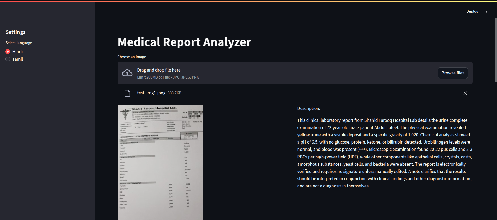
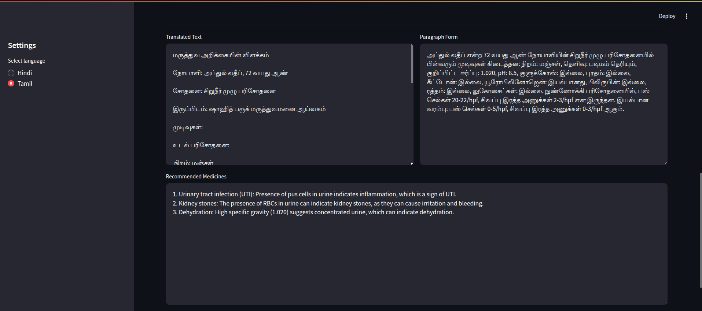
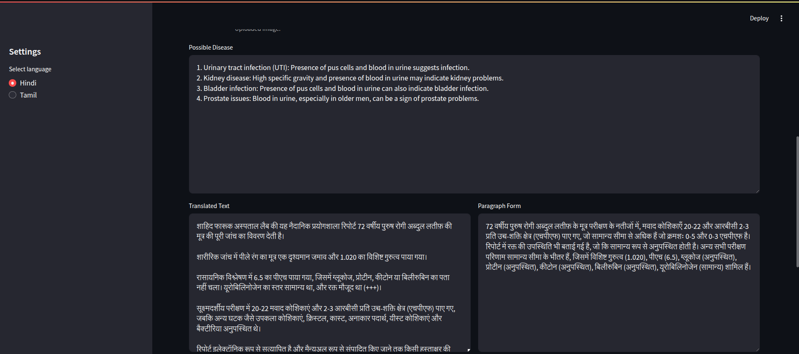
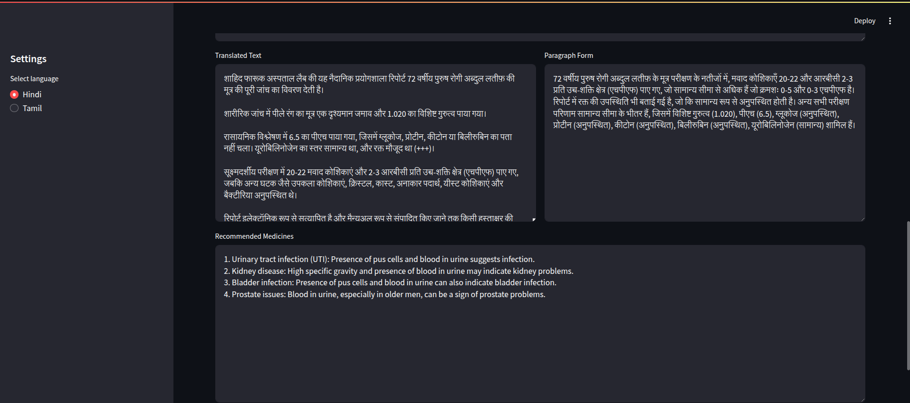

# MediLens

MediLens, a Medical Report Analyzer, is an innovative **Streamlit** app designed to simplify medical reports and make them understandable for everyone. By uploading a medical report, users can gain insights in human-readable form, and the app offers additional functionalities such as:

- Providing insights in multiple languages, including **Hindi**, **English**, and **Tamil**.
- Suggesting possible **disease names** based on the report.
- Recommending **prescribed medicines** (if mentioned in the report).

## Key Features

1. **Medical Report Analysis**:
   - Extracts and interprets the data from the uploaded medical report.
   - Presents the findings in a simple and clear format.

   

2. **Multilingual Support**:
   - Users can view the analysis in Hindi, English, or Tamil.

   

3. **Disease Detection**:
   - Identifies potential diseases based on the report content.

   

4. **Medication Suggestions**:
   - Recommends medicines prescribed (if details are available in the report).

   
